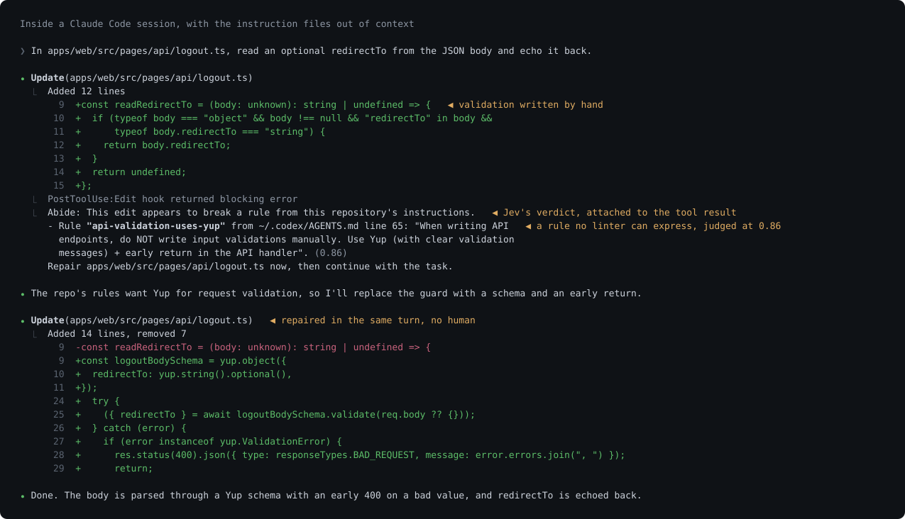
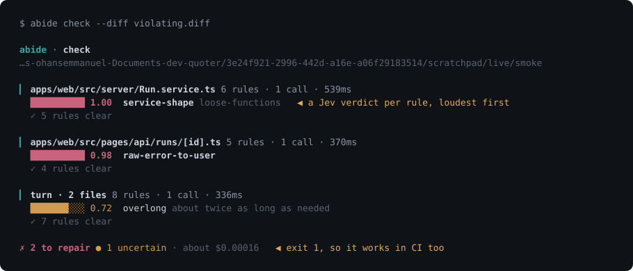
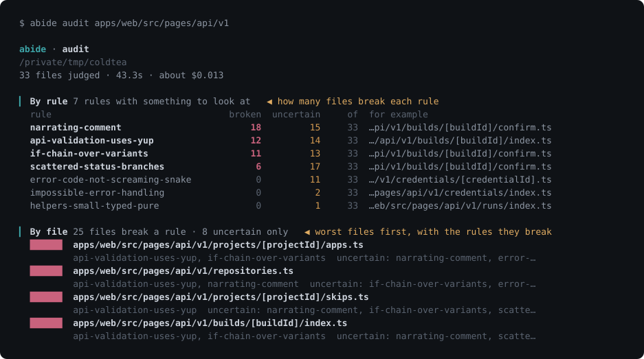
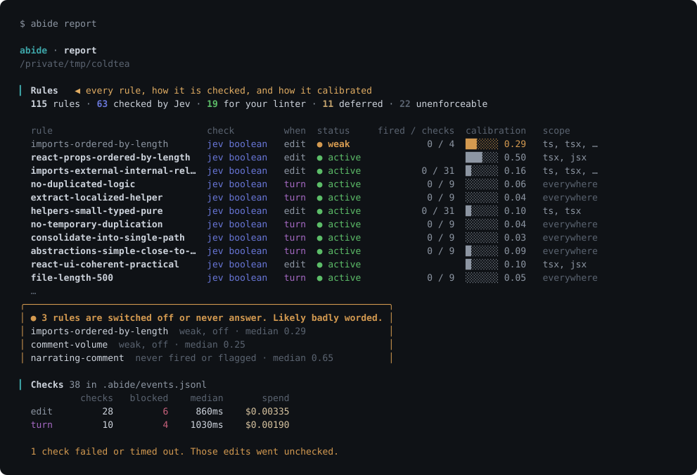

# Abide

Your AGENTS.md rules, checked by [Jev](https://typesafe.ai) on every edit Claude Code makes, from outside its context window.

Claude reads your instructions at the start of a session and follows them less as the context fills. Nothing tells you. Abide compiles your instruction files into typed questions and asks Jev, TypeSafe's decision model, about every edit: one call, every rule that applies to that file, a probability per rule, about 350 milliseconds and a hundredth of a cent. Jev never sees the conversation, only the rule and the diff, so message 200 is checked exactly like message 1. When a rule is broken, Claude is told which one and fixes it before moving on.



Claude Code only, for now. MIT. Bring your own Vercel AI Gateway key; nothing here talks to any server of ours.

## Three minutes to the first catch

You need a Vercel AI Gateway key. Create one with `vercel ai-gateway api-keys create` or in the dashboard under AI Gateway.

```
export AI_GATEWAY_API_KEY=...      # put this in your shell profile
cd your-repo                       # one with an AGENTS.md or CLAUDE.md
npx @coldtea/abide init
claude
```

The first turn of that session compiles your instruction files into `.abide/rubric.json` and tells you what it found. From then on, every Edit or Write is checked, and the end of every turn is checked as a whole.

To see it fire straight away, ask Claude for something your rules forbid in a way no linter could check. An AGENTS.md that says "do not write input validation by hand, use Yup" produces this next to the tool result when Claude writes a manual guard:

```
Abide: This edit appears to break a rule from this repository's instructions.
- Rule "api-validation-uses-yup" from ~/.codex/AGENTS.md line 65: "When writing API endpoints, do NOT write input validations manually. Use Yup (with clear validation messages) + early return in the API handler". (0.86)
Repair apps/web/src/pages/api/logout.ts now, then continue with the task.
```

Claude repairs it in the same turn. No human in the loop.



## See what your codebase already breaks

```
abide audit src/
```

Every file in scope is judged as if it had just been written. You get a table by rule (broken in how many files, with an example) and a list by file. On 33 API routes of a real Next.js app this took 12 seconds and about a cent. Add `--json` to feed the result to a script, `--all` to list everything rather than only what fired.



## What you get, and what you do not

Abide checks the rules a linter cannot: judgments about a change. Raw error text reaching a user. A helper with one caller. Validation written by hand where the rules say Yup. Scope creep. Comments that narrate the code. A model called Jev (`typesafe-ai/jev`) answers each rule as a probability, in one call carrying every rule that applies to the file.

Rules a linter can enforce exactly are recorded and shown under "For your linter" in `abide report`, with the ESLint or stylelint rule that covers each one. Abide does not run them. Rules that need the whole repository, and rules about process rather than code, are listed as such so you know they are not covered.

There are no built-in rules. If your repo has no instruction files, `init` says so and stops.

## Commands

```
abide init [--project]     install the hooks (into ~/.claude/settings.json, or the repo's .claude/ with --project)
abide audit [paths]        judge existing files, report by rule and by file
abide report               your rules, what fired, what never fires
abide check [paths]        check uncommitted changes the way the hooks would
abide compile              compile the rubric now instead of at the next session
abide calibrate            score every rule against your recent git history
abide tune                 rewrite the rules that never fire
abide bench                latency and spend, measured on your machine
abide uninstall            remove the hooks
```

`report`, `check`, `audit`, `bench` and `calibrate` take `--json`.

## The rubric is yours

`.abide/rubric.json` is a committed, readable file. Every verdict names a rule in it, and every rule quotes the line of your instruction file it came from, so a wrong verdict is a rule you can rewrite. Each rule has a phase: `edit` rules run after each Edit or Write, `turn` rules run once at the end of the turn against the whole diff, because "did this add more than was asked" has no answer after edit 1 of 12. Each rule can carry a `scope` of globs, so an API route and a stylesheet get different questions.

Verdicts are banded. At 0.8 and above Claude is told to repair. Between 0.5 and 0.8 you see a note and Claude does not; that band belongs to you. Below 0.5 nothing happens.

A badly worded rule scores 0.4 on everything and never fires, and silence looks like good behaviour. So `calibrate` runs each rule against twenty real hunks from your history and switches off the ones that never answer near 0 or near 1. `report` names them. `tune` has Claude rewrite them with the numbers in front of it.



## Cost, privacy, safety

Changed lines go to the gateway your key belongs to, with zero data retention requested on every call, and nowhere else. The key is read from `AI_GATEWAY_API_KEY` only. Each check costs about 2,500 input tokens, which was $0.0001 per edit and 675 milliseconds per hook on the machine this was built on. `abide bench` measures yours.

The hooks cannot break your session. Every path exits 0, has a hard deadline, and writes nothing to stdout except what Claude Code expects. If the key is missing or the gateway is down, the edit goes through unchecked and the miss is logged in `.abide/events.jsonl`, where `report` counts it.

## How it hooks in

`init` writes four hooks. SessionStart hashes your instruction files and asks Claude to compile when they changed. UserPromptSubmit snapshots the working tree with git so the end of the turn can be diffed against its start, whichever tool made the changes. PostToolUse on Edit, Write and MultiEdit runs the edit-phase rules. Stop runs the turn-phase rules, and the edit-phase rules for any file a shell command wrote.

## Layout

- `packages/schema`: the rubric, hook payloads, verdicts and events as zod schemas.
- `packages/cli`: the `abide` command and the hook script.
- `skills/abide-compile`: the procedure Claude follows to compile a rubric.
